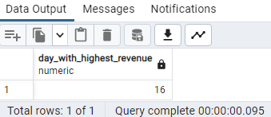

# TINY_SHOP_SALES

## ABOUT CASE STUDY
This is the first SQL case study challenge created by a data community named DATA IN MOTION,LLC. 
Certain questions were provided which are needed to be answered.

### DATASETS
The dataset provided consist of four tables namely customers,products, orders and order_items.
- Customers: customer_id, first_name, last_name, email.
- Products: product_id, product_name, price.
- Orders: order_id, customer_id, order_date
- Order_items: order_id, product_id, quantity

## QUESTIONS
1. Which product has the highest price? Only return a single row.
2. Which customer has made the most orders?
3. What’s the total revenue per product?
4. Find the day with the highest revenue.
5. Find the first order (by date) for each customer.
6. Find the top 3 customers who have ordered the most distinct products
7. Which product has been bought the least in terms of quantity?
8. What is the median order total?
9. For each order, determine if it was ‘Expensive’ (total over 300),      ‘Affordable’ (total over 100), or ‘Cheap’.
10. Find customers who have ordered the product with the highest price.

### FUNCTIONS AND STATEMENTS USED
- Basic aggregations
- CASE WHEN statements
- Window Functions
- Joins
- CTEs

## OUTPUT/ANSWER TO EACH QUESTION
1. 

2. 

3. 

4. 

5. 

6. 

7. 

8. 

9. 

10. 

NOTE: Queries can be found in the file named Tiny_Shop_Sales.sql 

